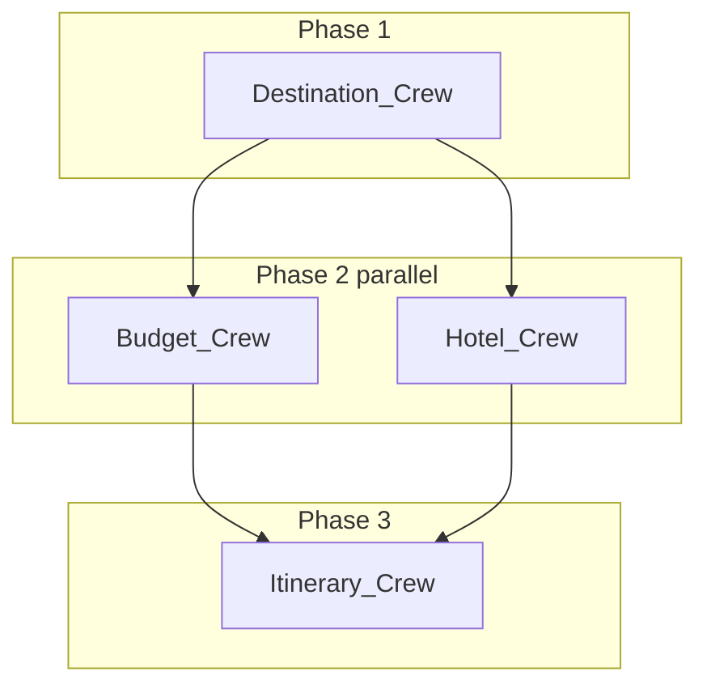

# Architecture — AI Travel Planner (CrewAI)

## Execution modes

CrewAI only offers `Process.sequential` and `Process.hierarchical` on a **single** `Crew`—there is no `Process.parallel`. To shorten wall-clock time, the **default** implementation uses **application-level parallelism**:

1. **Phase 1:** One one-task `Crew` runs the **Destination Researcher**.
2. **Phase 2:** Two one-task `Crew`s run in **parallel threads**: **Budget Planner** and **Hotel Finder** (each with fresh agent instances). The hotel task uses the **destination JSON** plus the user’s **budget_hint** (budget JSON is not available yet in that same moment).
3. **Phase 3:** One one-task `Crew` runs the **Itinerary Generator** with **all three** prior JSON blobs injected into the prompt.

Set `TRAVEL_PLANNER_PARALLEL=0` or pass `--sequential` on the CLI to use the original **single Crew** with four tasks and strict `Task.context` chaining (slower, but hotel sees the budget agent’s output inside the same run).

### Design trade-off: parallel Budget ∥ Hotel (intentional)

| | Parallel (default) | Sequential (`--sequential`) |
|--|-------------------|----------------------------|
| **Hotel Finder inputs** | Destination JSON + **user `budget_hint` / message** (+ conversation context). **Does not** see Budget Planner’s Pydantic output. | Sees prior tasks via CrewAI **`context`**: hotel step runs **after** budget, so **full alignment** with `overall_band` and `stated_budget_interpretation`. |
| **Goal** | **Lower wall-clock time** (two LLM calls overlap in phase 2). | **Stricter logical coupling** between budget band and hotel picks; **higher latency**. |
| **Reconciliation** | **Itinerary** step receives **both** budget JSON and hotel JSON and can describe a coherent trip; grader-facing docs should state this trade-off explicitly. | N/A — single linear dependency chain. |

This is a **documented engineering trade-off for speed**, not an oversight. Mention it in README/demo video if the assignment rewards explicit reasoning about multi-agent orchestration.

### Parallel flow (default)

## Agents and structured stages

| Step | Agent | Pydantic output |
|------|--------|-----------------|
| 1 | Destination Researcher | `DestinationResearchOutput` |
| 2 | Budget Planner | `BudgetPlanOutput` |
| 3 | Hotel Finder | `HotelFinderOutput` |
| 4 | Itinerary Generator | `ItineraryOutput` |

## Session memory (follow-ups)

1. **Gradio / CLI:** `memory.format_conversation_context` turns prior chat turns into the `{conversation_context}` block in every task description so refinements (e.g. “make it low-cost”) apply across the crew.
2. **CrewAI unified memory:** Optional (`TRAVEL_PLANNER_UNIFIED_MEMORY=true`). Off by default in the UI for speed.

## Optional tools

If `SERPER_API_KEY` is set, **Serper** search is attached to the **Destination Researcher** and **Hotel Finder** (see `src/agents.py`).

## Gradio UI behaviour

- **Status label** above the chatbot shows pipeline phase while agents run.
- **Send button** is disabled during a run to prevent duplicate submissions (re-enabled on completion).
- **Chat bubbles** store a short summary (destination, budget band, hotel names, itinerary title) instead of the full JSON blob, keeping `conversation_context` small on follow-ups.
- Full results are available in the **Structured JSON** and **Human-readable** tabs.

## Error handling

- `PipelineError` (defined in `parallel_pipeline.py`) wraps agent failures so the UI can distinguish them from unexpected crashes.
- Phase 2 thread futures are individually caught with a configurable timeout (`TRAVEL_PLANNER_PHASE_TIMEOUT`, default 300s). If one agent fails, the error message names which phase broke.
- The Gradio exception handler re-raises `KeyboardInterrupt` and `SystemExit`; agent/pipeline errors are logged to the console and surfaced in the JSON report.

## Components (repo)

| File | Role |
|------|------|
| [src/agents.py](../src/agents.py) | Four agent definitions (env-var config cached via `lru_cache`) |
| [src/tasks.py](../src/tasks.py) | Sequential four-task chain |
| [src/tasks_parallel.py](../src/tasks_parallel.py) | Single-task prompts + JSON injection |
| [src/parallel_pipeline.py](../src/parallel_pipeline.py) | Threaded phase 2 orchestration + `PipelineError` |
| [src/schemas.py](../src/schemas.py) | Pydantic schemas (documented with docstrings) |
| [src/crew.py](../src/crew.py) | Sequential `Crew` assembly |
| [src/memory.py](../src/memory.py) | Session context + default inputs |
| [src/followup_context.py](../src/followup_context.py) | JSON extraction from chat + refinement tagging |
| [src/utils.py](../src/utils.py) | Shared helpers (`dump_model`, `normalize_chat_history`, `TripInputs`, `TurnResult`) |
| [src/main.py](../src/main.py) | CLI + `run_pipeline` router |
| [app_gradio.py](../app_gradio.py) | UI (status label, button disable, summary chat bubbles) |
| [tests/](../tests/) | Pytest suite (schemas, followup_context, memory, utils) |
